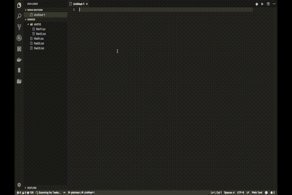

# README

This extension does grep and output result to a file.

## Features

1. You can search word in current workspace.
    * This extension checks whether there is a word for each line.
1. You'll get a file, which has result of grep.
1. You can use regular expression for grep.

    1. You can use following regular expression flags

        * i: ignore case

## Usage

### Regular Expression

Regular expression format

* re/{pattern}/{flags}

Examples

* re/LO/i

* re/dolor(|e)/

## Configuration

### grep2file.exclude

You can exclude files which have specified extensions.

### grep2file.outputFileName

You can change output file name.

### grep2file.outputContentFormat

You can opt following format.

* txt: default format

* csv: csv format

* tsv: tsv format

### grep2file.outputTitle

You can opt following options.

* true: output title which is grep configuration

* false: hide title which is grep configuration

### grep2file.ignoreHiddenFile

You can ignore hidden file from search target

* true: ignore hidden file from search

* false: include hidden file in search target