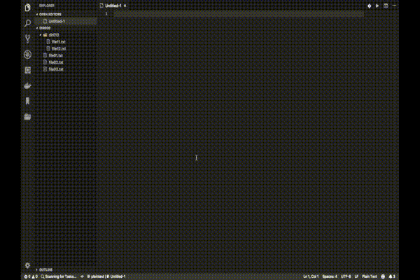

# grepextension README

This extension does grep and output result to a file.

## Features

1. You can search word in current workspace.
    * This extension checks whether there is a word for each line.
1. You'll get a file, which has result of grep.
1. You can use regular expression for grep.

    1. You can use following regular expression flags

        * i: ignore case

## Usage

### Normal Grep

### Regular Expression

Regular expression format

* re/\<pattern\>/\<flags\>

Examples

* re/LO/i

* re/dolor(|e)/
