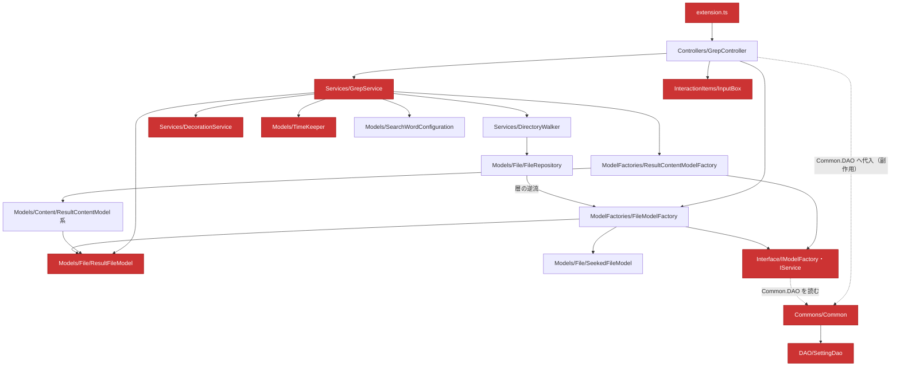
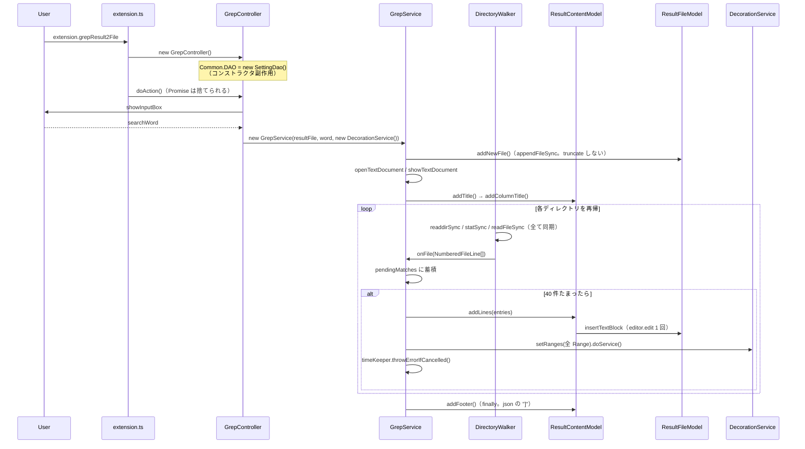

# 現状アーキテクチャと問題点の棚卸し

対象コミット: `159276e`（2026-07-28 時点）
規模: 本番コード 25 ファイル / 約 1,120 行、テスト 14 ファイル / 約 1,150 行、ランタイム依存ゼロ。

このドキュメントは**現状の記述**に徹する。あるべき姿と移行計画は [target-architecture.md](target-architecture.md) を参照。

---

## 1. レイヤ構成 — 意図と実態

### 1.1 意図されたレイヤ

```
extension → Controllers → Services → ModelFactories → Models → DAO
                                  ┌ Commons（横断）
                                  └ Interface（横断）
```

### 1.2 実際の依存グラフ



赤は `vscode` を import している 9 ファイル。

### 1.3 レイヤ規約が崩れている 3 箇所

| # | 箇所 | 内容 |
|---|---|---|
| 1 | [`Models/File/FileRepository.ts:2`](../../src/Models/File/FileRepository.ts) | `Models` が `ModelFactories/FileModelFactory` を import し、それが `Models/File/*` に戻る。**層の逆流**。ファイル単位の循環 import ではないためコンパイルは通るが、依存の向きは逆。 |
| 2 | [`Interface/IModelFactory.ts:2`](../../src/Interface/IModelFactory.ts) | 「インターフェース層」が `Commons/Common` → `DAO/SettingDao` → `vscode` を引きずり込む。最上位の抽象が最下層に依存している。 |
| 3 | `vscode` を import する 9 ファイル | `extension.ts` / `Commons/Common.ts` / `DAO/SettingDao.ts` / `InteractionItems/InputBox.ts` / `Interface/IService.ts` / `Models/TimeKeeper.ts` / `Models/File/ResultFileModel.ts` / `Services/GrepService.ts` / `Services/DecorationService.ts`。Model 層が QuickPick を出し、`TextEditor` を保持して `editor.edit()` を実行している。 |

### 1.4 実質的にヘッドレスなファイルは 6 つだけ

ほぼ全ファイルが `Commons/Common` を推移的に import するため、`vscode` モジュール無しで読み込めるのは以下のみ:

`Commons/Lazy.ts` / `Commons/Message.ts` / `DAO/BaseDao.ts` / `Models/SearchWordConfiguration.ts` / `Models/Content/ContentInformation.ts` / `ModelFactories/ContentInformationFactory.ts`

**結果として、12 個のユニットテストファイルのうち素の Mocha で動かせるのは `Lazy.test.ts` と `SearchWordConfiguration.test.ts` の 2 つだけ**。残り 10 個は「ユニットテスト」を名乗りながら Electron 版 VS Code の起動を要求する。

---

## 2. メインフローのトレース

ユーザーが `Grep to File` を実行してから装飾が表示されるまで。



### 2.1 位置計算の仕組み（最も壊しやすい部分）

出力ドキュメントへの書き込みは常に `Position(document.lineCount, 0)`。VS Code はこれをドキュメント末尾にクランプする。

- [`ResultFileModel.insertText`](../../src/Models/File/ResultFileModel.ts) は編集**後**の `lineCount - 1` を返す。
- [`ResultFileModel.insertTextBlock`](../../src/Models/File/ResultFileModel.ts) は編集**前**の `lineCount - 1` を返す。

**この 2 つの戻り値の意味が違う点は要注意。** 実際に使われているのは後者だけで、前者の戻り値は `_lineNumberOfContentStart`（どこからも読まれない）に入るだけ。

この位置計算は「直前の挿入が必ず改行で終わっている」ことに依存している。だから [`ResultContentCSVModel.ts:23-26`](../../src/Models/Content/ResultContent/ResultContentCSVModel.ts) に「末尾の改行は必須」という長い説明コメントがあり、[`ResultContentModel.ts:138-141`](../../src/Models/Content/ResultContent/ResultContentModel.ts) にはそれを剥がし直す説明コメントがある。**説明コメントが必要になっている時点で設計の匂い。**

### 2.2 `Title` と `ColumnTitle` は別々の挿入だが同じ行に載る

`Title` は末尾に改行を持たないため、続く `ColumnTitle` の挿入が同じ行に着地する。txt のゴールデンファイルの 3 行目がその証拠:

```
Search Dir: <WORKSPACE>
Search Word: lo
RegExpMode: OFF	FilePath	lineNumber	TextLine
```

→ **この 2 つを 1 つの `header()` にまとめてもバイト単位で同一の出力になる。** 無料で得られる単純化。

---

## 3. 問題点の棚卸し

各項目に対応する移行フェーズは [target-architecture.md](target-architecture.md) の §5 を参照。

### 優先度: 高 — 構造の根幹

#### P1. グローバル可変サービスロケータ `Common.DAO`

[`Commons/Common.ts:30-39`](../../src/Commons/Common.ts) の static mutable フィールド。
[`Controllers/GrepController.ts:12`](../../src/Controllers/GrepController.ts) のコンストラクタ**副作用**で書かれ、[`Interface/IModelFactory.ts:11`](../../src/Interface/IModelFactory.ts) の**フィールド初期化子**で読まれる。生成順序が暗黙の前提になっていて、コードを読んでも見えない。テスト間でリセットもされない。

**実害の具体例**: [`ModelFactories/ResultContentModelFactory.ts:34`](../../src/ModelFactories/ResultContentModelFactory.ts) は呼び出し元が持っている dao ではなく `Common.DAO` を注入する。このため [`src/test/unit/GrepService.test.ts`](../../src/test/unit/GrepService.test.ts) の `FakeDao` は `ResultFileModel` には届くが `ResultContentModel` には届かない。**`outputTitle` の既定値がたまたま `true` だから通っているだけ**で、このテストは意図した対象を検証できていない。

#### P2. `vscode` API のモデル層への侵入

§1.3・§1.4 の通り。ヘッドレスなシームが存在せず、`.vscode-test.mjs` が `out/test/**/*.test.js` を一括で拾う構成と相まって、純粋な文字列処理のテストまで 60 秒タイムアウト付きの VS Code ホスト起動を必要としている。

#### P3. 責務の混在

| クラス | 行数 | 兼務している責務 |
|---|---|---|
| [`ResultContentModel`](../../src/Models/Content/ResultContent/ResultContentModel.ts) | 211 | フォーマッタ + ドキュメント書き込み + 行番号管理 + アキュムレータ |
| [`ResultFileModel`](../../src/Models/File/ResultFileModel.ts) | 124 | 設定解決 + パス組み立て + `fs` 書き込み + ライブエディタ操作 |
| [`SeekedFileModel`](../../src/Models/File/SeekedFileModel.ts) | 143 | パス解析 + `fs` 探索 + 内容読み込み + バイナリ判定 + 除外ポリシー |
| [`GrepService`](../../src/Services/GrepService.ts) | 181 | オーケストレーション + バッチ制御 + Range 計算 + ユーザー通知 + エラー分類 |

### 優先度: 中 — 正しさ

#### P4. `exclude: []` が全ファイルを除外する（最も深刻なバグ）

3 つのバグが連鎖している:

1. [`DAO/SettingDao.ts:25`](../../src/DAO/SettingDao.ts) — `typeof value !== 'boolean' && value.length === 0` で**空配列を「未設定」とみなして** defaultValue を返す。
2. [`SeekedFileModel.ts:106`](../../src/Models/File/SeekedFileModel.ts) — その defaultValue が `['']`。
3. [`SeekedFileModel.ts:114`](../../src/Models/File/SeekedFileModel.ts) — `new RegExp('', 'i')` は**あらゆる拡張子にマッチする**。

→ ユーザーが「何も除外しない」意図で `grep2file.exclude: []` を設定すると、**ワークスペース内の全ファイルが除外され、grep 結果が空になる**。

**テストがこのバグを隠している**: [`FakeDao`](../../src/test/testUtils/FakeDao.ts) は `hasOwnProperty` で判定するだけなので `[]` をそのまま返す。つまり**テストダブルと本番の `SettingDao` は空配列の意味論が食い違っている**。[`SeekedFileModel.test.ts:10-15`](../../src/test/unit/SeekedFileModel.test.ts) の `daoWithNoExclusions()` は `exclude: []` を渡して「除外なし」を表現しており、テスト上はそれが期待通りに動く。本番では同じ設定が正反対の結果になる。

#### P5. `exclude` の正規表現が未エスケープ・未アンカー

同じく `SeekedFileModel.ts:114`。`new RegExp(extension, "i")` に生の設定値を渡すため:

- `exclude: ["c"]` → `.csv` / `.cs` / `.cpp` も除外される
- `exclude: ["c++"]` → 正規表現の構文エラーで例外

加えて [`package.json:25-36`](../../package.json) のスキーマが `"type": ["string","null"]` なのに既定値が配列で、宣言と実態が矛盾している。テスト側にこの挙動を回避するコメントが [`src/test/unit/SeekedFileModel.test.ts:10-15`](../../src/test/unit/SeekedFileModel.test.ts) にある。

#### P6. CSV/TSV にクォート・エスケープ処理が一切ない

[`ResultContentCSVModel.getFormattedContent`](../../src/Models/Content/ResultContent/ResultContentCSVModel.ts) は単に `join(separator)` するだけ。マッチ文字列にカンマやタブが含まれると行が壊れ、`extractContentAndOffset` がセパレータ分割でオフセットを求めるため**装飾位置もずれる**。

現在のゴールデンファイル `expected/grep2File.g2f.csv` は既に不正な CSV になっている:

```
Search Dir: ... | RegExpMode: OFF,<WORKSPACE>/dir1/dir1-1/fileC.txt,2,"Lorem ipsum dolor sit amet, 
```

最終フィールドに未エスケープのカンマと閉じられていないダブルクォートが同居している。

#### P7. エラーの握り潰しと `this` バインドの潜在バグ

- [`extension.ts:8`](../../src/extension.ts) が `doAction()` の Promise を捨てている。
- [`GrepController.doAction`](../../src/Controllers/GrepController.ts) が `this.callback` を**バインドせずに**渡している。`callback` がたまたま `this` を触らないので動いているだけで、`this` を使う変更を加えた瞬間に壊れる。
- `openTextDocument` / `showTextDocument` の失敗は `grep()` の try/catch の外にあるため、**ユーザーに何も表示されないまま unhandled rejection になる**。

### 優先度: 中 — 性能・リソース

| # | 箇所 | 内容 |
|---|---|---|
| P8 | [`GrepService.ts:156`](../../src/Services/GrepService.ts) | `setRanges(this.allRanges).doService()` を毎バッチ**全 Range** に対して呼ぶ。結果件数に対して O(n²) のマーシャリング。 |
| P9 | [`DecorationService.ts`](../../src/Services/DecorationService.ts) | `TextEditorDecorationType` をフィールド初期化子で生成し dispose しない。コマンド実行のたびに新規生成され、`context.subscriptions` にも載らない（[`extension.ts`](../../src/extension.ts) は `ExtensionContext` を外に渡していない）。ウィンドウを閉じるまで積み上がる。 |
| P10 | [`ResultContentModel.ts:96`](../../src/Models/Content/ResultContent/ResultContentModel.ts) | `contentInformations` に 1 行 1 オブジェクト蓄積するが**どこからも読まれない**。クラス名の付いたメモリリーク。 |
| P11 | [`SeekedFileModel.ts:96-98`](../../src/Models/File/SeekedFileModel.ts) | `stat` がゲッターで毎回 `statSync`。`FileRepository` の除外判定と `DirectoryWalker` の `isDirectory` / `isFile` で **1 エントリあたり 2 回以上の syscall**。 |
| P12 | 全体 | I/O が全て同期（`readdirSync` / `statSync` / `readFileSync`）で拡張ホストのスレッドをブロック。`DirectoryWalker.walk` は `async` の形をしているが実際の非同期 I/O はない。 |

### 優先度: 低 — 継承設計・デッドコード・設定

#### P13. 継承による多態の歪み

- `ResultContentTSVModel extends ResultContentCSVModel` — セパレータが違うだけ。TSV は実装の偶然によってのみ CSV の一種。
- `ResultContentJSONModel extends ResultContentModel` — `ColumnTitle` → `""`、`extractContentAndOffset` → `null` と親の契約を無効化する **Liskov 違反**。

#### P14. デッドコード

| 対象 | 備考 |
|---|---|
| `ResultContentModel.addLine()` | `addLines()` に置き換えられた |
| `ResultContentModel.getContentInOneLine()` | **本番では未使用だが、4 つのユニットテストファイルの唯一の検証対象**。テストごと差し替える必要がある |
| `lineNumberOfCursor` / `lineNumberOfContentStart` | 一度も読まれない |
| `TimeKeeper.isConfirmationTime()` | 一度も呼ばれない |
| `ResultFileModel.initialLastLine` と [`initialize()` の恒真式](../../src/Models/File/ResultFileModel.ts) | `this._initialLastLine === 0 ? 0 : ...` は 0 しか代入し得ない |
| `type IModel = object` | 何も制約しない |
| `ContentInformation` / `ContentInformationFactory` | P10 の蓄積先。丸ごと不要 |
| `'use strict';` 宣言（5 ファイル） | ES モジュールでは無意味 |

#### P15. 設定の残骸

| ファイル | 内容 |
|---|---|
| [`tsconfig.json`](../../tsconfig.json) | `jsx: "react"` / `jsxFactory: "vscpp"` / `jsxFragmentFactory`（JSX 不使用）。`include` / `exclude` の欠如。`noUnusedLocals` 未設定 |
| [`.vscodeignore`](../../.vscodeignore) | `tslint.json`（tslint はとうに削除済み）。`.github/**` や `eslint.config.mjs` は未除外 |
| [`.vscode/extensions.json`](../../.vscode/extensions.json) | `eg2.tslint` を推奨したまま |

---

## 4. 良くできている点（壊さないこと）

リファクタリングで失いたくない既存の設計判断:

1. **[`ResultContentModelFactory`](../../src/ModelFactories/ResultContentModelFactory.ts) の登録テーブル** — `Record<string, Constructor>` によるフォーマット分岐。switch 文からの改善で、新フォーマットの追加が 1 行で済む。**この形は目標構造でも維持する。**
2. **バッチ書き込み（`BATCH_SIZE = 40`）** — [`GrepService.ts:17-24`](../../src/Services/GrepService.ts) のコメントが理由を正確に説明している。`editor.edit()` はメイン/レンダラプロセスへのラウンドトリップなので、1 行ごとに呼ぶと UI スレッドの負荷に grep 全体が引きずられる。
3. **`SearchWordConfiguration.getRegExp(isGlobal)`** — global フラグ付き RegExp をキャッシュしない理由（`lastIndex` の状態を持つため）がコメントで説明されている。正しい判断。
4. **`CancellationError`** — ユーザーによるキャンセルと本物の失敗を型で区別している。
5. **統合テストのクロスプラットフォーム正規化** — [`extension.test.ts`](../../src/test/extension.test.ts) の `normalizePaths` / `sortForComparison`。`readdirSync` の順序保証がないこと、`.gitattributes` による改行正規化が OS ごとに違うことへの対処。CI 安定化の成果物。
6. **`Lazy<T>`** — `hasValue` フラグにより falsy 値も正しくキャッシュする。素直な実装。
7. **ランタイム依存ゼロ** — 維持する価値がある。

---

## 5. 誤解しやすい点（「修正」してはいけないもの）

調査中に「バグに見えるが実は正しい／意図的」と判明したもの。移行時に善意で壊さないための記録。

| 対象 | 実態 |
|---|---|
| `ResultContentModel.extractContentAndOffset` の `reduce`（初期値なし） | `outputTitle` の ON / OFF どちらでも**正しく動く**。トレース済み。修正対象ではなく、削除対象（目標構造ではオフセットを整形時に算出するため不要になる） |
| `ResultFileModel.addNewFile()` の `appendFileSync(path, '')` | truncate しない。**同じコマンドを 2 回実行すると既存の結果ファイルに追記される**のが現在の挙動。ゴールデンテストは Arrange でエディタを空にするためこれを隠している。移行時もこの挙動を再現すること |
| `TimeKeeper.checkConsumedTime` が QuickPick を await しない | 意図的な fire-and-forget。await すると確認ダイアログが開いている間 grep が停止し、**挙動が変わる**。維持すること |
| `getFormattedContent` が引数配列を破壊的に変更（`contents[0] = ""` / `contents.shift()`） | 呼び出し側が毎回リテラルを新規生成しているため現状は無害。ただし目標構造では純粋関数にする |
